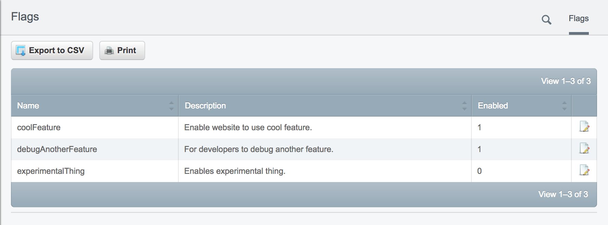
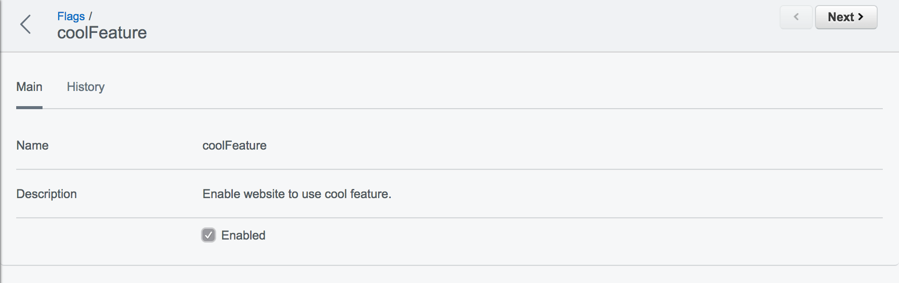
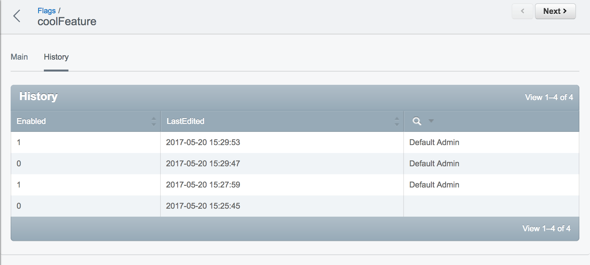

# silverstripe-flags

Feature flag toggling for SilverStripe.

## Usage

Add your flags to your website or module config:

```yml
Flag:
  flags:
    - Name: coolFeature
      Description: "Enable website to use cool feature."
      Enabled: true
    - Name: debugAnotherFeature
      Description: "For developers to debug another feature."
    - Name: experimentalThing
      Description: "Enables experimental thing."
```

You can then write code to be conditional based on if a flag is enabled:

```php
    if (Flag::isEnabled('coolFeature')) {
        // Do something cool
    }
```

```html
    <% if FlagIsEnabled("experimentalThing") %>
        <%-- Experimental thing template --%>
    <% end_if %>
```

Flags can be toggled in the CMS:





You can also see the history of changes to a flag:



## Requirements

- Silverstripe 3+

## Installation

The recommended way to install is through Composer:

```
composer require jacobbuck/silverstripe-flags
```
